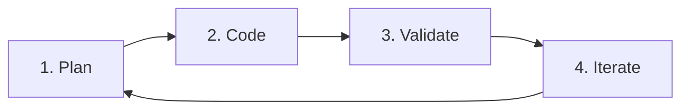

# Project Rules & Architectural Guidelines

This project follows the official **Flutter AI Best Practices & Spec-Driven Development** (https://docs.flutter.dev/ai/best-practices/developer-experience).

---

## 1. Core Architectural Principles

- **DRY (Don't Repeat Yourself)**: Eliminate duplicated logic by extracting shared utilities, styles, network clients, and data models into `lib/core/` and reusable modules.
- **Separation of Concerns**: Strictly separate responsibilities across layers:
  - **Presentation (`lib/*/presentation/`)**: UI Widgets, screens, dialogs, state listeners only. No business or direct HTTP logic.
  - **Domain / Models (`lib/*/models/`)**: Immutable data classes, JSON serialization (`fromJson`/`toJson`), business entities.
  - **Data / Services (`lib/*/services/` or `lib/core/network/`)**: API communication, local storage, security, authentication tokens.
- **Single Responsibility Principle (SRP)**: Every class, module, function, and file must have exactly one distinct reason to change.
- **Clear Abstractions & Contracts**: Expose clear intent via clean interfaces and repository/service abstractions; keep private helper details internal.
- **Low Coupling, High Cohesion**: Keep features independent and modular so changes in one domain do not break others.

---

## 2. Spec-Driven Development Workflow

Every new feature, component, or refactoring must strictly follow the 4-phase cycle:

1. **Plan**:
   - Check or create feature specification in the `plans/` folder (e.g., `plans/requirements.md`).
   - Define data models, state flows, and UI contracts before writing code.
2. **Code**:
   - Write clean, modular Dart code conforming to `flutter_lints`.
   - Apply effective Dart conventions (use `const`, avoid deprecated members, strict null safety).
3. **Validate**:
   - Run static analysis: `dart analyze` (must have 0 errors and 0 warnings).
   - Run unit and widget tests: `flutter test`.
   - Verify layout and design responsiveness.
4. **Iterate**:
   - Refactor based on test results and feedback.

---

## 3. Tooling & MCP Integration Rules

- Utilize the installed Dart & Flutter MCP tools (`pub_dev_search`, `analyze_files`, `lsp`, `hot_reload`, `widget_inspector`, `get_runtime_errors`) during coding and debugging.
- After any code modification, always verify static analysis passes before completing the task.
